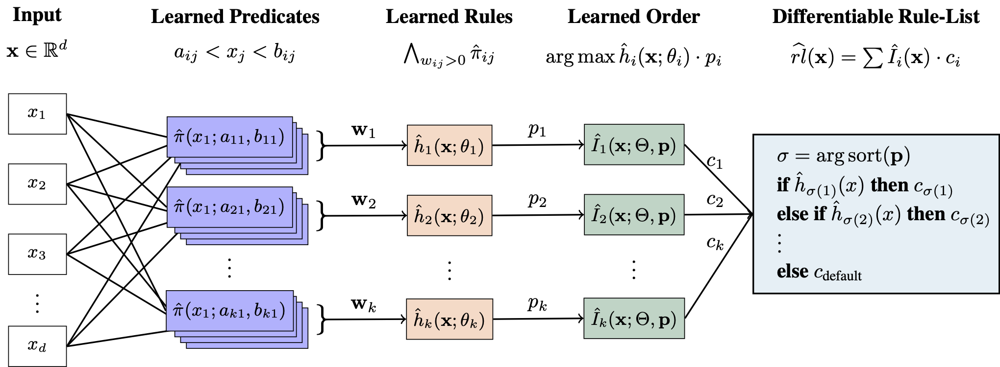

# Neural Rule Lists: Learning Discretizations, Rules, and Order in One Go.
This repository contains the implementation of <span style="font-variant: small-caps;">NeuRules</span>, an inherently interpretable and fully differentiable rule list classifier that jointly learns how to discretize continuous features into binary 
conditions, how to select and combine these conditions into conjunctive rules, and how to order the rules into a list.
The [paper](https://eda.rg.cispa.io/pubs/2025/neurules-xu,walter,vreeken.pdf) (Neurips 2025) describes the method in detail and provides extensive experimental evaluation.


<p align="center">
  
</p>

## Basic Usage
We implement <span style="font-variant: small-caps;">NeuRules</span>
 as a PyTorch model. You can use it like any other PyTorch model. Below is an example of how to use it on the german credit dataset   [1]. You can find and execute this demo in "demo.ipynb".

```python
from neurules import NeuralRuleList
from configs import *
from utils import get_data_limits, get_dataset, binarize_categorical, Temperature_Scheduler
from sklearn.preprocessing import StandardScaler
from sklearn.model_selection import train_test_split
from training import train_model
import torch

# load example dataset: credit_g
dataset, _ = get_dataset("credit_g")
X = dataset["data"]
X, dataset["feature_names"] = binarize_categorical(X, dataset["feature_names"])
Y = dataset["target"]
X_train, X_test, Y_train, Y_test = train_test_split(
    X, Y, test_size=0.2, random_state=42
)
scaler_X = StandardScaler()
X_train = scaler_X.fit_transform(X_train)
X_test = scaler_X.transform(X_test)

X_train = torch.tensor(X_train, dtype=torch.float32)
Y_train = torch.tensor(Y_train, dtype=torch.long)
X_test = torch.tensor(X_test, dtype=torch.float32)
Y_test = torch.tensor(Y_test, dtype=torch.long)

# initialize NeuRules thresholds with data limits
init_thresholds = get_data_limits(X_train)

model_config = Rule_Config(X_train.shape[1],2,10)
model = NeuralRuleList(model_config, init_thresholds)

training_setup = Train_Config()
predicate_schedule = Temperature_Scheduler(training_setup.n_epochs//2,model_config.schedule_predicate_temperature)
selector_schedule = Temperature_Scheduler(training_setup.n_epochs//2,model_config.schedule_selector_temperature)
temp_schedule = [predicate_schedule, selector_schedule]
model = train_model(model,X_train,Y_train,torch.nn.CrossEntropyLoss(),training_setup)

# evaluate on test set
model.eval()
with torch.no_grad():
    Y_logits = model(X_test)
    Y_pred = Y_logits.argmax(dim=1)
    accuracy = (Y_pred == Y_test).float().mean().item()
    print(f"Test Accuracy: {accuracy*100:.2f}%")
    
    # print learned rule list
    limits = get_data_limits(X_train)
    rule_list = model.print_rule_list(limits, scaler_x=scaler_X, feature_names=dataset["feature_names"])
    print("Learned Rule List:")
    print(rule_list)
```

## Requirements and Experiments
You can setup an Anaconda Python environment to install all dependencies using
```
conda env create -f environment.yml
```
For Ripper, please install Weka (https://sourceforge.net/projects/weka/).

The code for <span style="font-variant: small-caps;">NeuRules</span>
 is provided in models.py, the training functions in training.py.

To run the real world, multi-class and ablation experiments, execute the respective shell scripts 
- run_real_world.sh
- run_multi_class.sh
- ablation_X.sh

For datasets that are not obtained via the imodels/pmlb packages respectively, please download them from the cited sources in the paper. Otherwise, their execution is skipped in the scripts. The datasets are
- android
- phishing
- electricity
- qsar_biodeg
- phoneme
- adult
- covid

## Citation
If you find this code useful in your research, please cite our paper as follows:

```
@inproceedings{xuneural,
  title={Neural Rule Lists: Learning Discretizations, Rules, and Order in One Go},
  author={Xu, Sascha and Walter, Nils Philipp and Vreeken, Jilles},
  booktitle={The Thirty-ninth Annual Conference on Neural Information Processing Systems},
  year={2025}
}
```

## References
[1] H. Hofmann. *Statlog (German Credit Data)*.  
Originally provided by Professor Hans Hofmann, Institut für Statistik und Ökonometrie, Universität Hamburg.  
Available from the UCI Machine Learning Repository:  
https://archive.ics.uci.edu/ml/datasets/statlog+(german+credit+data)